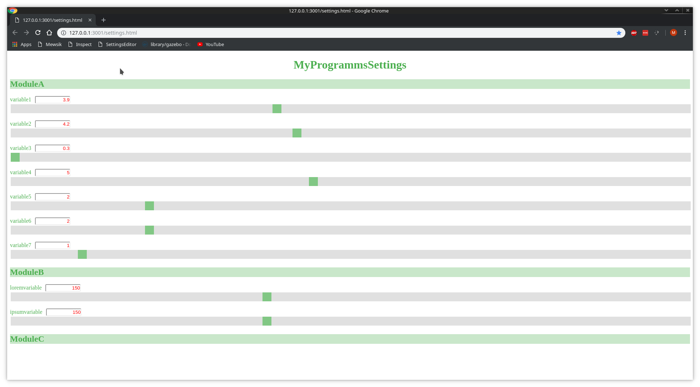

# SettingsEditor
## Goal
Quite often when you design a software, you need the programm to load pre-defined settings.
One approach, is to use a JSON file as that contains all the settings.
If the software re-read the settings upon each modification of the file, you settings can then be modified and tooked into account "live" during the execution of the programm.
However, editing the JSON file with a text-editor can be user unfriedly and actually dangerous. Think for instance

* What happen if the user corrupt the file during the programm execution?
* What happen if the user set a parameter value out of bounds (for instance a negative time duration)? 

The pupose of SettingsEditor is to provide the user with a graphical front-end where he can edit the settings in a guided manner.

## Architectrure
SettingsEditor is a NodeJs server, that send the JSON file the client side. 
The clientside is made of an html page plus a Javascript file.
On a settings get modified, the client side send a POST request to the server containing the modification.
The server will then update the file 

## Feature list 

### WebPage design
* Description of variable should appear as "What's this" on the webpage
* Add an option "Set back to factory"
* Add support for string variables 
* Add support for multiple choice variables (Combobox)
* Make the serverals headings and subheadings of the JSON file as collapsible element.

### Extensions
* Integration in Qt Project, via a Qt Classe that handle the reading of the JSON file and automatically update it upon modification.

